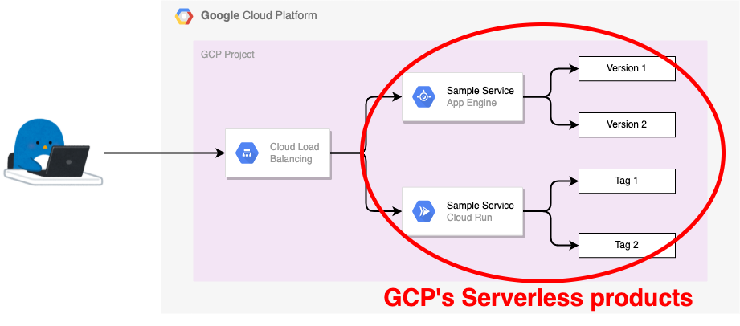

# Hands On Serverless Network Endpoint Group

Network Endpoint Group = NEG

## [Serverless NEG of multiple service](./multi-serverless-application/)

## [Serverless NEG of multiple versions of a single service](./multi-serverless-version/)

