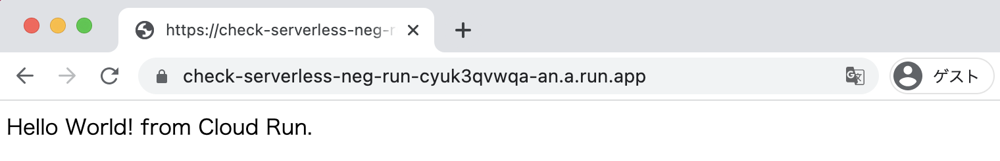
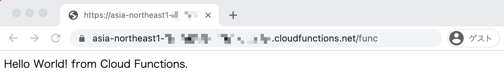

# Hands On Serverless Network Endpoint Group

Network Endpoint Group = NEG


## Documents

Serverless network endpoint groups overview

+ https://cloud.google.com/load-balancing/docs/negs/serverless-neg-concepts?hl=en

Setting up serverless NEGs

+ https://cloud.google.com/load-balancing/docs/negs/setting-up-serverless-negs?hl=en

HTTP(S) Load Balancing for serverless apps


## Prepare gcloud command

+ GCP authentication.

```
gcloud auth login -q
```

+ Setting Environment

```
### New Env

export _gcp_pj_id='Your GCP Project ID'
export _common='check-serverless-neg'
export _region='asia-northeast1'
```

## Prepare API

+ Enable API on Project

```
gcloud beta services enable cloudbuild.googleapis.com --project ${_gcp_pj_id}
gcloud beta services enable run.googleapis.com --project ${_gcp_pj_id}
gcloud beta services enable cloudfunctions.googleapis.com --project ${_gcp_pj_id}
gcloud beta services enable compute.googleapis.com --project ${_gcp_pj_id}
```

## Prepare Sample Code

+ Clone Repository

```
git clone https://github.com/iganari/handson-serverless-neg.git
cd handson-serverless-neg
```

## Create Sample Cloud Run

+ Official Document
  + https://cloud.google.com/run/docs/quickstarts/build-and-deploy?hl=en

+ Change to the sample code directory for Cloud Run.

```
cd cloudrun
```

+ Build your container image using Cloud Build

```
gcloud beta builds submit --tag gcr.io/${_gcp_pj_id}/${_common}-run --project ${_gcp_pj_id}
```

+ Deploy to Cloud Run

```
gcloud beta run deploy ${_common}-run \
  --image gcr.io/${_gcp_pj_id}/${_common}-run \
  --platform managed \
  --region ${_region} \
  --allow-unauthenticated \
  --project ${_gcp_pj_id}
```
```
### Ex.

# gcloud beta run deploy ${_common}-run \
>   --image gcr.io/${_gcp_pj_id}/${_common}-run \
>   --platform managed \
>   --region ${_region} \
>   --allow-unauthenticated \
>   --project ${_gcp_pj_id}
Deploying container to Cloud Run service [check-serverless-neg-run] in project [Your GCP Project ID] region [asia-northeast1]
✓ Deploying new service... Done.
  ✓ Creating Revision... Creating Service.
  ✓ Routing traffic...
  ✓ Setting IAM Policy...
Done.
Service [check-serverless-neg-run] revision [check-serverless-neg-run-00001-dij] has been deployed and is serving 100 percent of traffic.
Service URL: https://check-serverless-neg-run-cyuk3qvwqa-an.a.run.app
```

+ Check Web Blawser.
  + The following URL is output to the output result of the deploy command above.
  + https://check-serverless-neg-run-cyuk3qvwqa-an.a.run.app



+ Back to root directory.

```
cd -
```

## Create Sample Google App Engine

+ Official Document
  + https://cloud.google.com/appengine/docs/standard/python3/quickstart?hl=en

+ Change to the sample code directory for App Engine.

```
cd appengine
```

+ Create yaml from Sample YAML.

```
cat app.yaml.sample | sed "s/YOUR_SERVICE/${_common}-app/g" > app.yaml
```

+ Setting Region on Current GCP Project.

```
gcloud beta app create --region ${_region} --project ${_gcp_pj_id}
```

+ Deploy App Engine.

```
gcloud beta app deploy --project ${_gcp_pj_id}
```

+ :fire: If you get the error "No default service", do the following

```
sed -i -e 's/service:/# service:/g' app.yaml
gcloud beta app deploy --project ${_gcp_pj_id}
```
```
sed -i -e 's/# service:/service:/g' app.yaml
gcloud beta app deploy --project ${_gcp_pj_id}
```

+ Check App Engine URL.

```
gcloud beta app browse -s ${_common}-app --project ${_gcp_pj_id}
```
```
### Ex.

# gcloud beta app browse -s ${_common}-app --project ${_gcp_pj_id}
Did not detect your browser. Go to this link to view your app:
https://check-serverless-neg-app-dot-[~~~~~~~~~~].an.r.appspot.com
```

+ Check Web Blawser.
  + The following URL is output to the output result of the deploy command above.
  + https://check-serverless-neg-app-dot-[~~~~~~~~~~].an.r.appspot.com


+ Back to root directory.

```
cd -
```

## Create Sample Cloud Functions

+ Official Document
  + https://cloud.google.com/functions/docs/tutorials/http?hl=en#functions-trigger-http-command-python

+ Change to the sample code directory for Cloud Functions.

```
cd functions
```

+ Deploy Cloud Functions.

```
gcloud beta functions deploy func \
  --runtime python38 \
  --trigger-http \
  --region ${_region} \
  --allow-unauthenticated \
  --project ${_gcp_pj_id}
```



+ Back to root directory.

```
cd -
```

## Prepare External IP Address

+ Reserving an External IP Address.

```
gcloud beta compute addresses create ${_common}-example-ip \
  --ip-version=IPV4 \
  --global \
  --project ${_gcp_pj_id}
```

+ Check External IP Address.

```
gcloud beta compute addresses describe ${_common}-example-ip \
  --format="get(address)" \
  --global \
  --project ${_gcp_pj_id}
```
```
### Ex.

# gcloud beta compute addresses describe ${_common}-example-ip \
>   --format="get(address)" \
>   --global \
>   --project ${_gcp_pj_id}
34.120.199.24
```

## Prepare Sub Domain

+ Set the reserved static IP address as an A record for your own subdomain.


## Create External HTTP(S) Load Balancer

### Create Serverless NEG

+ Create Cloud Run's Serverless NEG.

```
gcloud beta compute network-endpoint-groups create ${_common}-serverless-neg-run \
  --region ${_region} \
  --network-endpoint-type SERVERLESS \
  --cloud-run-service ${_common}-run \
  --project ${_gcp_pj_id}
```

+ Create App Engine's Serverless NEG.

```
gcloud beta compute network-endpoint-groups create ${_common}-serverless-neg-app \
  --region ${_region} \
  --network-endpoint-type SERVERLESS \
  --app-engine-service ${_common}-app \
  --project ${_gcp_pj_id}
```

+ Create Cloud Functions's Serverless NEG. 

```
gcloud beta compute network-endpoint-groups create ${_common}-serverless-neg-func \
  --region ${_region} \
  --network-endpoint-type SERVERLESS  \
  --cloud-function-name func \
  --project ${_gcp_pj_id}
```

+ Check NEG.
  + :warning: Right now, we can't see Serverless NEG in the console.

```
gcloud beta compute network-endpoint-groups list --project ${_gcp_pj_id}
```
```
### Ex.

# gcloud beta compute network-endpoint-groups list
NAME                                     LOCATION         ENDPOINT_TYPE  SIZE
check-serverless-neg-serverless-neg-app   asia-northeast1  SERVERLESS     0
check-serverless-neg-serverless-neg-func  asia-northeast1  SERVERLESS     0
check-serverless-neg-serverless-neg-run   asia-northeast1  SERVERLESS     0
```

### Create Backend Service

+ Create Cloud Run's backend service.

```
gcloud beta compute backend-services create ${_common}-backend-service-run \
  --global \
  --project ${_gcp_pj_id}
```

+ Create App Engine's backend service.

```
gcloud beta compute backend-services create ${_common}-backend-service-app \
  --global \
  --project ${_gcp_pj_id}
```

+ Create Cloud Functions's backend service.

```
gcloud beta compute backend-services create ${_common}-backend-service-func \
  --global \
  --project ${_gcp_pj_id}
```

+ Check Backend Services.

```
gcloud beta compute backend-services list --project ${_gcp_pj_id}
```
```
### Ex.

# gcloud beta compute backend-services list --project ${_gcp_pj_id}
NAME                                      BACKENDS  PROTOCOL
check-serverless-neg-backend-service-app            HTTP
check-serverless-neg-backend-service-func           HTTP
check-serverless-neg-backend-service-run            HTTP
```


########### ここまで ##############


### Add the Serverless NEG as a backend to the Backend Service

+ Add Cloud Run's Serverless NEG as a backend to Cloud Run's Backend Service

```
gcloud beta compute backend-services add-backend ${_common}-backend-service-run \
  --global \
  --network-endpoint-group ${_common}-serverless-neg-run \
  --network-endpoint-group-region ${_region} \
  --project ${_gcp_pj_id}
```

+ Add App Engine's Serverless NEG as a backend to App Engine's Backend Service

```
gcloud beta compute backend-services add-backend ${_common}-backend-service-app \
  --global \
  --network-endpoint-group ${_common}-serverless-neg-app \
  --network-endpoint-group-region ${_region} \
  --project ${_gcp_pj_id}
```

+ Add Cloud Functions's Serverless NEG as a backend to Cloud Functions's Backend Service

```
gcloud beta compute backend-services add-backend ${_common}-backend-service-func \
  --global \
  --network-endpoint-group ${_common}-serverless-neg-func \
  --network-endpoint-group-region ${_region} \
  --project ${_gcp_pj_id}
```

+ Check Backend Service.

```
gcloud beta compute backend-services list --project ${_gcp_pj_id}
```
```
### Ex.

# gcloud beta compute backend-services list --project ${_gcp_pj_id}
NAME                                       BACKENDS                                                                        PROTOCOL  LOAD_BALANCING_SCHEME  HEALTH_CHECKS
check-serverless-neg-backend-service-app   asia-northeast1/networkEndpointGroups/check-serverless-neg-serverless-neg-app   HTTP      EXTERNAL
check-serverless-neg-backend-service-func  asia-northeast1/networkEndpointGroups/check-serverless-neg-serverless-neg-func  HTTP      EXTERNAL
check-serverless-neg-backend-service-run   asia-northeast1/networkEndpointGroups/check-serverless-neg-serverless-neg-run   HTTP      EXTERNAL
```

### Create a URL map

+ To route incoming requests to the check-serverless-neg-backend-service backend service.
  + The default settings should map to Cloud Run.

```
gcloud beta compute url-maps create ${_common}-url-map \
  --default-service ${_common}-backend-service-run \
  --project ${_gcp_pj_id}
```

+ Set other than the default setting of URL map.

```
gcloud beta compute url-maps add-path-matcher ${_common}-url-map \
  --path-matcher-name ${_common}-path-matcher \
  --path-rules "/app=check-serverless-neg-backend-service-app,/func=check-serverless-neg-backend-service-func" \
  --default-service=check-serverless-neg-backend-service-run \
  --project ${_gcp_pj_id}
```

+ Check URL map

```
gcloud beta compute url-maps list --project ${_gcp_pj_id}
```
```
### Ex.

# gcloud beta compute url-maps list --project ${_gcp_pj_id}
NAME                          DEFAULT_SERVICE
check-serverless-neg-url-map  backendServices/check-serverless-neg-backend-service-run
```

### Create Certificate

+ To create a Google-managed SSL certificate resource called www-ssl-cert.

```
export _my_domain=$(echo ${_common}.iganari.xyz)

echo ${_my_domain}
```
```
gcloud beta compute ssl-certificates create ${_common}-www-ssl-cert \
  --domains ${_my_domain} \
  --project ${_gcp_pj_id}
```

+ Check certificate resource.

```
gcloud beta compute ssl-certificates list --project ${_gcp_pj_id}
```
```
### Ex.

# gcloud beta compute ssl-certificates list --project ${_gcp_pj_id}
NAME                               TYPE     CREATION_TIMESTAMP             EXPIRE_TIME  MANAGED_STATUS
check-serverless-neg-www-ssl-cert  MANAGED  2022-01-03T16:38:14.097-08:00               PROVISIONING
    check-serverless-neg.iganari.xyz: PROVISIONING
```
```
# gcloud beta compute ssl-certificates list --project ${_gcp_pj_id}
NAME                               TYPE     CREATION_TIMESTAMP             EXPIRE_TIME                    MANAGED_STATUS
check-serverless-neg-www-ssl-cert  MANAGED  2022-01-03T16:38:14.097-08:00  2022-04-03T16:38:15.000-07:00  ACTIVE
    check-serverless-neg.iganari.xyz: ACTIVE
```

### Create Target Proxy

+ Create a target HTTPS proxy to route requests to your URL map

```
gcloud beta compute target-https-proxies create ${_common}-https-proxy \
  --ssl-certificates ${_common}-www-ssl-cert \
  --url-map ${_common}-url-map \
  --project ${_gcp_pj_id}
```

+ Check Target HTTP(S) Proxy

```
gcloud beta compute target-https-proxies list --project ${_gcp_pj_id}
```
```
### Ex.

# gcloud beta compute target-https-proxies list --project ${_gcp_pj_id}
NAME                              SSL_CERTIFICATES                   URL_MAP
check-serverless-neg-https-proxy  check-serverless-neg-www-ssl-cert  check-serverless-neg-url-map
```

### Create Forwarding Rule of Load Balancer

+ Create a global forwarding rule to route incoming requests to the proxy.

```
gcloud beta compute forwarding-rules create ${_common}-https-content-rule \
  --address ${_common}-example-ip \
  --target-https-proxy ${_common}-https-proxy \
  --global \
  --ports 443 \
  --project ${_gcp_pj_id}
```

+ Check global forwarding rule.

```
gcloud beta compute forwarding-rules list --project ${_gcp_pj_id}
```
```
### Ex.

# gcloud beta compute forwarding-rules list --project ${_gcp_pj_id}
NAME                                     REGION  IP_ADDRESS     IP_PROTOCOL  TARGET
check-serverless-neg-https-content-rule          34.120.199.24  TCP          check-serverless-neg-https-proxy
```

---> Congratulations, You have created an External HTTP(S) Load Balancer using Serverless NEG!!

## Check Web blawser

Check the resources with a Web browser.

+ URL map on GCP console.


+ "/" maps to Cloud Run.


+ "/run" maps to Cloud Run.


+ "/app" maps to App Engine.


+ "/func" maps to Cloud Functions.


+ If none of the above rules apply, it is mapped to Cloud Run.


## Delete Resource

Delete the Resources created so far using the gloud command.

+ Delete global forwarding rule

```
gcloud beta compute forwarding-rules delete ${_common}-https-content-rule --global --project ${_gcp_pj_id}
```

+ Delete Target HTTP(S) Proxy

```
gcloud beta compute target-https-proxies delete ${_common}-https-proxy --project ${_gcp_pj_id}
```


```
gcloud beta compute ssl-certificates delete ${_common}-www-ssl-cert 

gcloud beta compute url-maps remove-path-matcher ${_common}-url-map --path-matcher-name=${_common}-path-matcher

gcloud beta compute url-maps delete ${_common}-url-map 

gcloud beta compute backend-services delete ${_common}-backend-service-app  --global
gcloud beta compute backend-services delete ${_common}-backend-service-func --global
gcloud beta compute backend-services delete ${_common}-backend-service-run  --global

gcloud beta compute network-endpoint-groups delete ${_common}-serverless-neg-app  --region=${_region} 
gcloud beta compute network-endpoint-groups delete ${_common}-serverless-neg-func --region=${_region} 
gcloud beta compute network-endpoint-groups delete ${_common}-serverless-neg-run  --region=${_region}

gcloud beta app services delete ${_common}-app
gcloud beta functions delete func --region ${_region}
gcloud beta run services delete ${_common}-run --platform managed --region ${_region}

gcloud compute addresses delete ${_common}-example-ip --global
```

## closing

Have Fan :)
