# Serverless NEG of multiple versions of a single service

## Overvew

Cloud Run and App Enngine can have multiple versions of a single service.

In addition, multiple versions of a single LB can be installed independently.

This article is that hands-on.

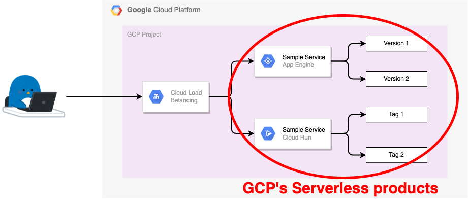

## Prepare gcloud command

+ GCP authentication.

```
gcloud auth login -q
```

+ Setting Environment

```
### New Env

export _gcp_pj_id='Your GCP Project ID'
export _common='ho-serverlessneg-ver'
export _region='asia-northeast1'
```

## Prepare API

+ Enable API on Project

```
gcloud beta services enable compute.googleapis.com --project ${_gcp_pj_id}
gcloud beta services enable run.googleapis.com --project ${_gcp_pj_id}
gcloud beta services enable artifactregistry.googleapis.com --project ${_gcp_pj_id}
```

## Prepare Sample Code

+ Clone Repository

```
git clone https://github.com/iganari/handson-serverless-neg.git
cd mulchi-serverless-version/
```

## Deploy App Engine

```
cd pyahon-sample
```

+ Create main.py for Version 1 of App Engine

```
cat main.py.sample | sed 's/_YOUR_COMMENT/This is Version 1 of App Engine/g' > main.py
```

+ Deploy AppEngine

```
gcloud beta app deploy app-service.yaml --version=version1 --project ${_gcp_pj_id}
```

+ Create main.py for Version 2 of App Engine

```
cat main.py.sample | sed 's/_YOUR_COMMENT/This is Version 2 of App Engine/g' > main.py
```

+ Deploy AppEngine

```
gcloud beta app deploy app-service.yaml --version=version2 --project ${_gcp_pj_id}
```

+ App Engine

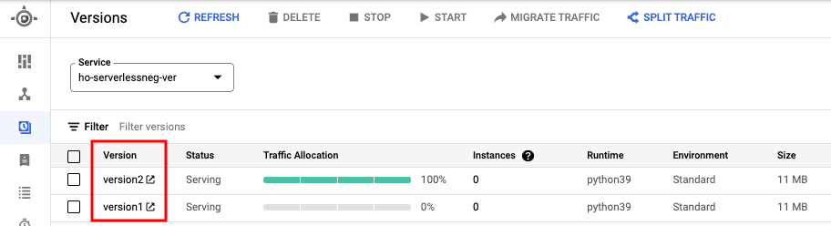

+ Version 1 of App Engine

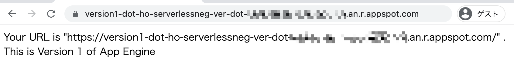

+ Version 2 of App Engine

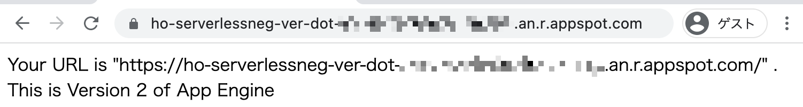

## Deploy Cloud Run

+ Prepare Artifact Registry

```
gcloud beta artifacts repositories create handson-serverless-neg \
  --location=asia \
  --repository-format docker \
  --project ${_gcp_pj_id}
```
```
gcloud auth configure-docker asia-docker.pkg.dev --project ${_gcp_pj_id}
```

+ Create main.py for Tag 1 of Cloud Run

```
cat main.py.sample | sed 's/_YOUR_COMMENT/This is Tag 1 of Cloud Run/g' > main.py
```

+ Push Container Image of Tag 1

```
docker build . --tag asia-docker.pkg.dev/${_gcp_pj_id}/handson-serverless-neg/${_common}:tag1
docker push          asia-docker.pkg.dev/${_gcp_pj_id}/handson-serverless-neg/${_common}:tag1
```

+ Deploy Cloud Run of Tag 1

```
gcloud beta run deploy ${_common} \
  --image asia-docker.pkg.dev/${_gcp_pj_id}/handson-serverless-neg/${_common}:tag1 \
  --port=5000 \
  --platform managed \
  --region ${_region} \
  --allow-unauthenticated \
  --tag=tag1 \
  --project ${_gcp_pj_id}
```

+ Create main.py for Tag 2 of Cloud Run

```
cat main.py.sample | sed 's/_YOUR_COMMENT/This is Tag 2 of Cloud Run/g' > main.py
```

+ Push Container Image of Tag 2

```
docker build . --tag asia-docker.pkg.dev/${_gcp_pj_id}/handson-serverless-neg/${_common}:tag2
docker push          asia-docker.pkg.dev/${_gcp_pj_id}/handson-serverless-neg/${_common}:tag2
```

+ Deploy Cloud Run of Tag 2

```
gcloud beta run deploy ${_common} \
  --image asia-docker.pkg.dev/${_gcp_pj_id}/handson-serverless-neg/${_common}:tag2 \
  --port=5000 \
  --platform managed \
  --region ${_region} \
  --allow-unauthenticated \
  --tag=tag2 \
  --project ${_gcp_pj_id}
```

+ Cloud Run

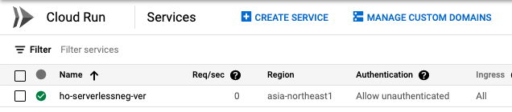

+ Cloud Run Revisions

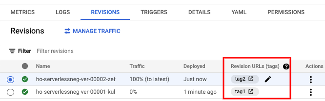

+ Cloud Run of Tag 1

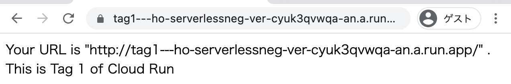

+ Cloud Run of Tag 2

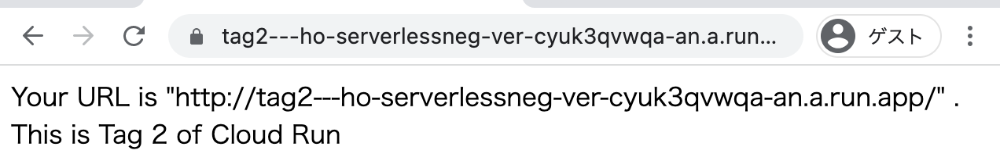

## Prepare External IP Address

+ Reserving an External IP Address.

```
gcloud beta compute addresses create ${_common}-example-ip \
  --ip-version=IPV4 \
  --global \
  --project ${_gcp_pj_id}
```

+ Check External IP Address.

```
gcloud beta compute addresses describe ${_common}-example-ip \
  --global \
  --format="get(address)" \
  --project ${_gcp_pj_id}
```
```
### Ex.

# gcloud beta compute addresses describe ${_common}-example-ip \
>   --global \
>   --format="get(address)" \
>   --project ${_gcp_pj_id}
34.120.199.24
```

## Prepare Sub Domain

+ Set the reserved static IP address as an A record for your own subdomain.

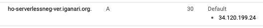

## Create External HTTP(S) Load Balancer

### Create Serverless NEG

+ Create Cloud Run's Serverless NEG.

```
gcloud beta compute network-endpoint-groups create ${_common}-serverless-neg-run-1 \
  --region ${_region} \
  --network-endpoint-type SERVERLESS \
  --cloud-run-service ${_common} \
  --cloud-run-tag=tag1 \
  --project ${_gcp_pj_id}
```
```
gcloud beta compute network-endpoint-groups create ${_common}-serverless-neg-run-2 \
  --region ${_region} \
  --network-endpoint-type SERVERLESS \
  --cloud-run-service ${_common} \
  --cloud-run-tag=tag2 \
  --project ${_gcp_pj_id}
```

+ Create App Engine's Serverless NEG.

```
gcloud beta compute network-endpoint-groups create ${_common}-serverless-neg-app-1 \
  --region ${_region} \
  --network-endpoint-type SERVERLESS \
  --app-engine-service ${_common} \
  --app-engine-version=version1 \
  --project ${_gcp_pj_id}
```
```
gcloud beta compute network-endpoint-groups create ${_common}-serverless-neg-app-2 \
  --region ${_region} \
  --network-endpoint-type SERVERLESS \
  --app-engine-service ${_common} \
  --app-engine-version=version2 \
  --project ${_gcp_pj_id}
```

+ Check NEG.
  + :warning: Right now, we can't see Serverless NEG in the console.

```
gcloud beta compute network-endpoint-groups list --project ${_gcp_pj_id}
```
```
### Ex.

# gcloud beta compute network-endpoint-groups list --project ${_gcp_pj_id}
NAME                                       LOCATION         ENDPOINT_TYPE  SIZE
ho-serverlessneg-ver-serverless-neg-app-1  asia-northeast1  SERVERLESS     0
ho-serverlessneg-ver-serverless-neg-app-2  asia-northeast1  SERVERLESS     0
ho-serverlessneg-ver-serverless-neg-run-1  asia-northeast1  SERVERLESS     0
ho-serverlessneg-ver-serverless-neg-run-2  asia-northeast1  SERVERLESS     0
```

### Create Backend Service

+ Create Cloud Run's backend service.

```
gcloud beta compute backend-services create ${_common}-backend-service-run-1 \
  --global \
  --project ${_gcp_pj_id}
```
```
gcloud beta compute backend-services create ${_common}-backend-service-run-2 \
  --global \
  --project ${_gcp_pj_id}
```

+ Create App Engine's backend service.

```
gcloud beta compute backend-services create ${_common}-backend-service-app-1 \
  --global \
  --project ${_gcp_pj_id}
```
```
gcloud beta compute backend-services create ${_common}-backend-service-app-2 \
  --global \
  --project ${_gcp_pj_id}
```

+ Check Backend Services.

```
gcloud beta compute backend-services list --project ${_gcp_pj_id}
```
```
### Ex.

# gcloud beta compute backend-services list --project ${_gcp_pj_id}
NAME                                        BACKENDS  PROTOCOL  LOAD_BALANCING_SCHEME  HEALTH_CHECKS
ho-serverlessneg-ver-backend-service-app-1            HTTP      EXTERNAL
ho-serverlessneg-ver-backend-service-app-2            HTTP      EXTERNAL
ho-serverlessneg-ver-backend-service-run-1            HTTP      EXTERNAL
ho-serverlessneg-ver-backend-service-run-2            HTTP      EXTERNAL
```

### Add the Serverless NEG as a backend to the Backend Service

+ Add Cloud Run's Serverless NEG as a backend to Cloud Run's Backend Service

```
gcloud beta compute backend-services add-backend ${_common}-backend-service-run-1 \
  --global \
  --network-endpoint-group ${_common}-serverless-neg-run-1 \
  --network-endpoint-group-region ${_region} \
  --project ${_gcp_pj_id}
```
```
gcloud beta compute backend-services add-backend ${_common}-backend-service-run-2 \
  --global \
  --network-endpoint-group ${_common}-serverless-neg-run-2 \
  --network-endpoint-group-region ${_region} \
  --project ${_gcp_pj_id}
```

+ Add App Engine's Serverless NEG as a backend to App Engine's Backend Service

```
gcloud beta compute backend-services add-backend ${_common}-backend-service-app-1 \
  --global \
  --network-endpoint-group ${_common}-serverless-neg-app-1 \
  --network-endpoint-group-region ${_region} \
  --project ${_gcp_pj_id}
```
```
gcloud beta compute backend-services add-backend ${_common}-backend-service-app-2 \
  --global \
  --network-endpoint-group ${_common}-serverless-neg-app-2 \
  --network-endpoint-group-region ${_region} \
  --project ${_gcp_pj_id}
```

+ Check Backend Service.

```
gcloud beta compute backend-services list --project ${_gcp_pj_id}
```
```
### Ex.

# gcloud beta compute backend-services list --project ${_gcp_pj_id}
NAME                                        BACKENDS                                                                         PROTOCOL  LOAD_BALANCING_SCHEME  HEALTH_CHECKS
ho-serverlessneg-ver-backend-service-app-1  asia-northeast1/networkEndpointGroups/ho-serverlessneg-ver-serverless-neg-app-1  HTTP      EXTERNAL
ho-serverlessneg-ver-backend-service-app-2  asia-northeast1/networkEndpointGroups/ho-serverlessneg-ver-serverless-neg-app-2  HTTP      EXTERNAL
ho-serverlessneg-ver-backend-service-run-1  asia-northeast1/networkEndpointGroups/ho-serverlessneg-ver-serverless-neg-run-1  HTTP      EXTERNAL
ho-serverlessneg-ver-backend-service-run-2  asia-northeast1/networkEndpointGroups/ho-serverlessneg-ver-serverless-neg-run-2  HTTP      EXTERNAL
```

### Create a URL map

+ To route incoming requests to the check-serverless-neg-backend-service backend service.
  + The default settings should map to Cloud Run.

```
gcloud beta compute url-maps create ${_common}-url-map \
  --default-service ${_common}-backend-service-run-1 \
  --project ${_gcp_pj_id}
```

+ Set other than the default setting of URL map.

```
gcloud beta compute url-maps add-path-matcher ${_common}-url-map \
  --path-matcher-name ${_common}-path-matcher \
  --path-rules "/run-1=${_common}-backend-service-run-1,/run-2=${_common}-backend-service-run-2,/app-1=${_common}-backend-service-app-1,/app-2=${_common}-backend-service-app-2" \
  --default-service=${_common}-backend-service-run-1 \
  --project ${_gcp_pj_id}
```

+ Re Setting url-maps
  + [Traffic management overview for global external HTTP(S) load balancer (classic) | Rewrites](https://cloud.google.com/load-balancing/docs/https/traffic-management#rewrites)
  + [Setting up URL rewrite for global external HTTP(S) load balancer (classic)s | Modifying the URL map](https://cloud.google.com/load-balancing/docs/https/setting-up-url-rewrite#modifying_the_url_map)


```
gcloud beta compute url-maps describe ${_common}-url-map --project ${_gcp_pj_id}
```
```
# gcloud beta compute url-maps describe ${_common}-url-map --project ${_gcp_pj_id}
creationTimestamp: '2022-01-21T02:52:25.351-08:00'
defaultService: https://www.googleapis.com/compute/beta/projects/your_gcp_pj_id/global/backendServices/ho-serverlessneg-ver-backend-service-run-1
fingerprint: 0QQUPP7g57o=
hostRules:
- hosts:
  - '*'
  pathMatcher: ho-serverlessneg-ver-path-matcher
id: '2462096409437351558'
kind: compute#urlMap
name: ho-serverlessneg-ver-url-map
pathMatchers:
- defaultService: https://www.googleapis.com/compute/beta/projects/your_gcp_pj_id/global/backendServices/ho-serverlessneg-ver-backend-service-run-1
  name: ho-serverlessneg-ver-path-matcher
  pathRules:
  - paths:
    - /app-1
    service: https://www.googleapis.com/compute/beta/projects/your_gcp_pj_id/global/backendServices/ho-serverlessneg-ver-backend-service-app-1
  - paths:
    - /app-2
    service: https://www.googleapis.com/compute/beta/projects/your_gcp_pj_id/global/backendServices/ho-serverlessneg-ver-backend-service-app-2
  - paths:
    - /run-1
    service: https://www.googleapis.com/compute/beta/projects/your_gcp_pj_id/global/backendServices/ho-serverlessneg-ver-backend-service-run-1
  - paths:
    - /run-2
    service: https://www.googleapis.com/compute/beta/projects/your_gcp_pj_id/global/backendServices/ho-serverlessneg-ver-backend-service-run-2
selfLink: https://www.googleapis.com/compute/beta/projects/your_gcp_pj_id/global/urlMaps/ho-serverlessneg-ver-url-map
```

```
gcloud beta compute url-maps describe ${_common}-url-map --project ${_gcp_pj_id} > ${_gcp_pj_id}.yaml
```
```
vim ${_gcp_pj_id}.yaml
```

+ Modify Setting
  + Add `pathMatchers.pathRules.routeAction`
  + Remove `id`

```
creationTimestamp: '2022-01-21T02:52:25.351-08:00'
defaultService: https://www.googleapis.com/compute/beta/projects/your_gcp_pj_id/global/backendServices/ho-serverlessneg-ver-backend-service-run-1
fingerprint: 0QQUPP7g57o=
hostRules:
- hosts:
  - '*'
  pathMatcher: ho-serverlessneg-ver-path-matcher
kind: compute#urlMap
name: ho-serverlessneg-ver-url-map
pathMatchers:
- defaultService: https://www.googleapis.com/compute/beta/projects/your_gcp_pj_id/global/backendServices/ho-serverlessneg-ver-backend-service-run-1
  name: ho-serverlessneg-ver-path-matcher
  pathRules:
  - paths:
    - /app-1
    routeAction:
      urlRewrite:
        pathPrefixRewrite: /
    service: https://www.googleapis.com/compute/beta/projects/your_gcp_pj_id/global/backendServices/ho-serverlessneg-ver-backend-service-app-1
  - paths:
    - /app-2
    routeAction:
      urlRewrite:
        pathPrefixRewrite: /
    service: https://www.googleapis.com/compute/beta/projects/your_gcp_pj_id/global/backendServices/ho-serverlessneg-ver-backend-service-app-2
  - paths:
    - /run-1
    routeAction:
      urlRewrite:
        pathPrefixRewrite: /
    service: https://www.googleapis.com/compute/beta/projects/your_gcp_pj_id/global/backendServices/ho-serverlessneg-ver-backend-service-run-1
  - paths:
    - /run-2
    routeAction:
      urlRewrite:
        pathPrefixRewrite: /
    service: https://www.googleapis.com/compute/beta/projects/your_gcp_pj_id/global/backendServices/ho-serverlessneg-ver-backend-service-run-2
selfLink: https://www.googleapis.com/compute/beta/projects/your_gcp_pj_id/global/urlMaps/ho-serverlessneg-ver-url-map
```

+ Validate the URL map.

```
gcloud beta compute url-maps validate --source ${_gcp_pj_id}.yaml --project ${_gcp_pj_id}
```

+ Update the URL map.

```
gcloud beta compute url-maps import ${_common}-url-map \
  --source ${_gcp_pj_id}.yaml \
  --global \
  --project ${_gcp_pj_id}
```

+ Check URL map

```
gcloud beta compute url-maps list --project ${_gcp_pj_id}
```
```
### Ex.

# gcloud beta compute url-maps list --project ${_gcp_pj_id}
NAME                          DEFAULT_SERVICE
ho-serverlessneg-ver-url-map  backendServices/ho-serverlessneg-ver-backend-service-run-1
```

### Create Certificate

+ To create a Google-managed SSL certificate resource called www-ssl-cert.

```
export _my_domain='ho-serverlessneg-ver.iganari.org'

echo ${_my_domain}
```
```
gcloud beta compute ssl-certificates create ${_common}-www-ssl-cert \
  --domains ${_my_domain} \
  --project ${_gcp_pj_id}
```

+ Check certificate resource.

```
gcloud beta compute ssl-certificates list --project ${_gcp_pj_id}
```
```
### Ex.

# gcloud beta compute ssl-certificates list --project ${_gcp_pj_id}
NAME                               TYPE     CREATION_TIMESTAMP             EXPIRE_TIME  MANAGED_STATUS
ho-serverlessneg-ver-www-ssl-cert  MANAGED  2022-01-17T12:30:33.639-08:00               PROVISIONING
    ho-serverlessneg-ver.iganari.org: PROVISIONING
```

### Create Target Proxy

+ Create a target HTTPS proxy to route requests to your URL map

```
gcloud beta compute target-https-proxies create ${_common}-https-proxy \
  --ssl-certificates ${_common}-www-ssl-cert \
  --url-map ${_common}-url-map \
  --project ${_gcp_pj_id}
```

+ Check Target HTTP(S) Proxy

```
gcloud beta compute target-https-proxies list --project ${_gcp_pj_id}
```
```
### Ex.

# gcloud beta compute target-https-proxies list --project ${_gcp_pj_id}
NAME                              SSL_CERTIFICATES                   URL_MAP
ho-serverlessneg-ver-https-proxy  ho-serverlessneg-ver-www-ssl-cert  ho-serverlessneg-ver-url-map
```

### Create Forwarding Rule of Load Balancer

+ Create a global forwarding rule to route incoming requests to the proxy.

```
gcloud beta compute forwarding-rules create ${_common}-https-content-rule \
  --address ${_common}-example-ip \
  --target-https-proxy ${_common}-https-proxy \
  --global \
  --ports 443 \
  --project ${_gcp_pj_id}
```

+ Check global forwarding rule.

```
gcloud beta compute forwarding-rules list --project ${_gcp_pj_id}
```
```
### Ex.

# gcloud beta compute forwarding-rules list --project ${_gcp_pj_id}
NAME                                     REGION  IP_ADDRESS     IP_PROTOCOL  TARGET
ho-serverlessneg-ver-https-content-rule          34.120.199.24  TCP          ho-serverlessneg-ver-https-proxy
```

---> Congratulations, You have created an External HTTP(S) Load Balancer using Serverless NEG!!


## Check Web blawser

Check the resources with a Web browser.

+ URL map on GCP console.

WIP

+ "/" maps to Cloud Run.

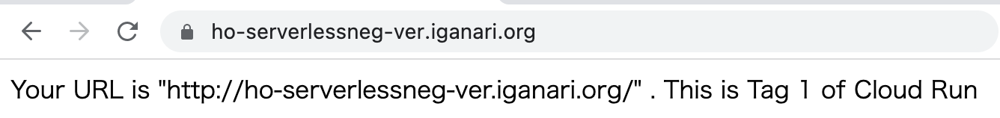

+ "/app-1" maps to App Engine.

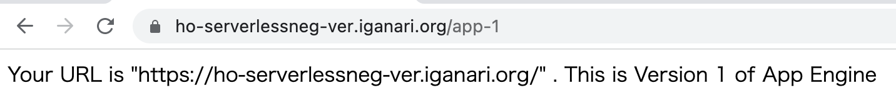

+ "/app-2" maps to App Engine.

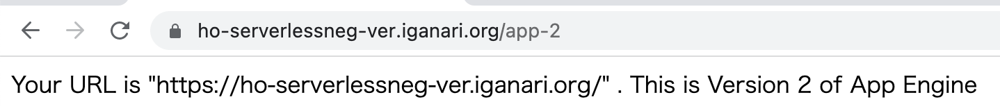

+ "/run-1" maps to Cloud Run.

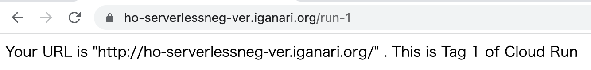

+ "/run-2" maps to Cloud Run.

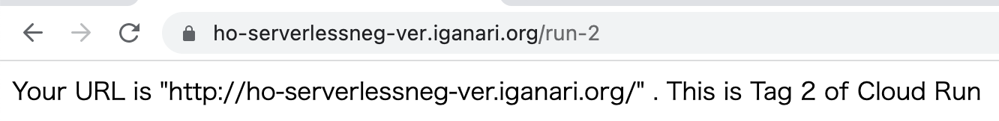

---> Congratulations, You have created an External HTTP(S) Load Balancer using Serverless NEG!! :)

## Delete Resource

Delete the Resources created so far using the gloud command.

+ Delete global forwarding rule

```
gcloud beta compute forwarding-rules delete ${_common}-https-content-rule --global --project ${_gcp_pj_id}
```

+ Delete Target HTTP(S) Proxy

```
gcloud beta compute target-https-proxies delete ${_common}-https-proxy --project ${_gcp_pj_id}
```

+ Delete Google-managed SSL certificate resource

```
gcloud beta compute ssl-certificates delete ${_common}-www-ssl-cert --project ${_gcp_pj_id}
```

+ Delete URL map

```
gcloud beta compute url-maps remove-path-matcher ${_common}-url-map --path-matcher-name=${_common}-path-matcher --project ${_gcp_pj_id}

gcloud beta compute url-maps delete ${_common}-url-map --project ${_gcp_pj_id}
```

+ Delete Backend Service

```
gcloud beta compute backend-services delete ${_common}-backend-service-app-1  --global --project ${_gcp_pj_id}
gcloud beta compute backend-services delete ${_common}-backend-service-app-2  --global --project ${_gcp_pj_id}
gcloud beta compute backend-services delete ${_common}-backend-service-run-1  --global --project ${_gcp_pj_id}
gcloud beta compute backend-services delete ${_common}-backend-service-run-2  --global --project ${_gcp_pj_id}
```

+ Delete Serverless NEG

```
gcloud beta compute network-endpoint-groups delete ${_common}-serverless-neg-app-1  --region=${_region} --project ${_gcp_pj_id}
gcloud beta compute network-endpoint-groups delete ${_common}-serverless-neg-app-2  --region=${_region} --project ${_gcp_pj_id}
gcloud beta compute network-endpoint-groups delete ${_common}-serverless-neg-run-1  --region=${_region} --project ${_gcp_pj_id}
gcloud beta compute network-endpoint-groups delete ${_common}-serverless-neg-run-2  --region=${_region} --project ${_gcp_pj_id}
```

+ Delete Serverless Service

```
gcloud beta app services delete ${_common} --project ${_gcp_pj_id}
gcloud beta run services delete ${_common} --platform managed --region ${_region} --project ${_gcp_pj_id}

gcloud beta container images delete asia-docker.pkg.dev/${_gcp_pj_id}/handson-serverless-neg/${_common}:tag1
```

+ Delete External IP Address

```
gcloud compute addresses delete ${_common}-example-ip --global --project ${_gcp_pj_id}
```

## Closing

Have Fan :)
